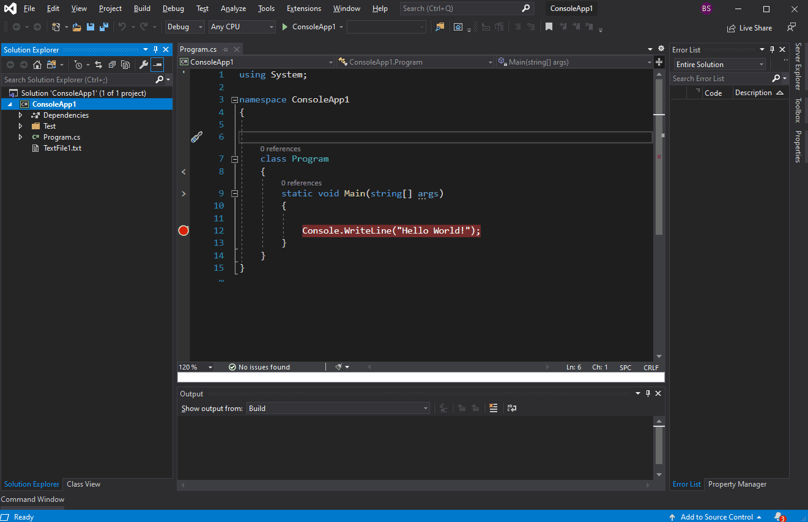
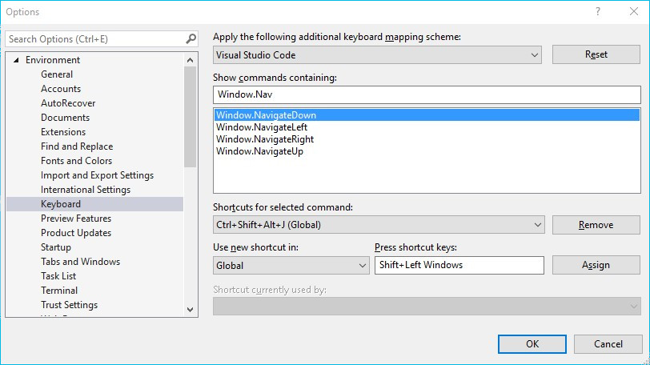

# Cardinal Navigation - A Visual Studio Extension 

  

A better way to change your active window from the keyboard.

Download this extension from the [Visual Studio Extension Marketplace](https://marketplace.visualstudio.com/items?itemName=BryceSmith.CardinalNavigation&ssr=false). See the [changelog](CHANGELOG.md) for release notes.

Inspired by [bspwm](https://github.com/baskerville/bspwm).

## Features

Adds four new commands to Visual Studio, each representing navigation in a cardinal direction:

- **Window: Navigate Left** - Select the tool or document window to the left of the active window.
- **Window: Navigate Right** - Select the tool or document window to the right of the active window.
- **Window: Navigate Up** - Select the tool or document window above the active window.
- **Window: Navigate Down** - Select the tool or document window below the active window.

In cases where multiple windows are eligible in a given direction, the window with the largest border or will be selected.

The commands work both in the main Visual Studio instance and in floating windows.

## Usage

You can choose new shortcuts for the commands under **Tools -> Options -> Environment -> Keyboard**.

## Contributing

Pull requests welcome. When opening issues, please include a stack trace if possible and a screenshot of your window configuration.
